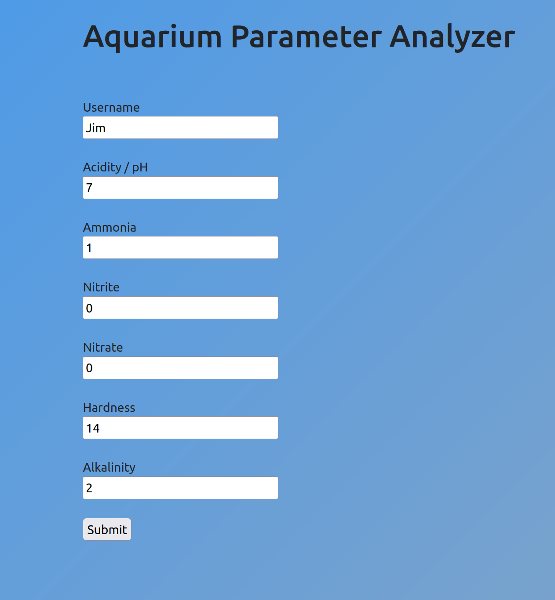

Introduction:
  A program for taking water parameters as inputs and informing you on the health of your aqaurium water.

Idea:
  I had this idea originally when I got my first fish tank, I wanted to make sure my water was healthy, however I did not want to memorize
  thresholds for water health, especially for the many different values you have to measure for.
  
  So, I created the following: https://github.com/gentcxc/C-Practice/blob/main/earlychapters_and_misc/fishwatertesting.c
  This is a program based on conditional logic, where the thresholds for "healthy" and "unhealthy" water are governed by
  values pulled from web articles. Built in the C language for personal use, I saw no problem, and still see no issue with confining this 
  program to the terminal.
  
  However, I believe it was a professor I had, said something along the lines of UI nightmares come from 2 things, programmers making
  software for other programmers, and perhaps worse, programmers writing for themselves.
  
  So, I decided to make a friendlier UI for the program, something usable to individuals who do not live inside the linux terminal. This was 
  a fun learning experience.
  
   
  
  
  The new version is written in PHP, and still has a long way to go in terms of looks and function. But for now, it mostly works. I linked it to a 
  MySQL database as well, just for the sake of doing so. Also the program's legibility is improved over the original with ternaries and generally 
  better practice.
  
  This was created with quick deployment in mind and the database configuration is NOT secure.
  
  Program still has overlap where water changes fix multiple problems at once, but the I/O isn't streamlined and uses primitive manually typed
  printfs.
